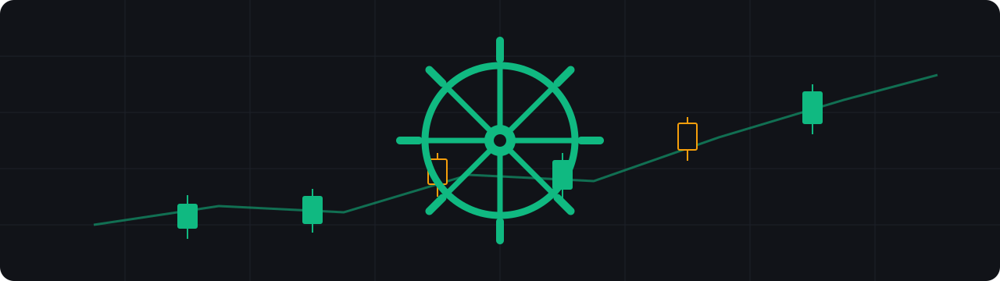

<p align="center">
  
</p>

# wheel-stack

**An autonomous options wheel engine for Alpaca** — sells cash-secured puts, manages them to profit or assignment, then sells covered calls, with multi-layer risk screens and self-healing data feeds.


## Features

- **Full wheel cycle** — cash-secured puts on fundamentally screened underlyings; on assignment, covered calls that respect your share cost basis (never sell a call below your net cost)
- **Model-first entry screens** — earnings calendar block, dividend ex-date risk, fundamentals (P/E, debt/equity, market cap, dividend yield, growth), realized-volatility regime with adaptive delta bands, liquidity trend scoring, and spread caps
- **Profit-taking closer** — buys back winners at 50% of max profit (DTE > 3), time-efficient 40% closes in the 7–21 DTE window, and locks in 75%+ gains immediately
- **Disciplined roller (v2.6)** — rolls threatened positions for a net credit only, at most twice per position lineage, then lets it ride; premium-loss alone never triggers a roll (requires < 1% OTM or |delta| ≥ 0.40); a last-day critical override still allows a small debit to avoid assignment. The close-before-open sequence polls until the freed buying power actually lands before submitting the new leg (v2.5.5)
- **Multi-source market data with automatic fallback** — Alpha Vantage primary; on failure, fundamentals fall back to Finnhub and price history to Alpaca daily bars, with a fail-stale on-disk cache as the last resort. A dead data provider never silently disables the screens
- **SGOV cash sweep** — idle cash is swept into short-term T-bill ETF exposure instead of sitting unearning, with next-day trade pre-funding (T+1 settlement aware). Isolated behind `SGOV_ENABLED` for brokers with native cash sweeps
- **Funding queue** — candidates that exceed settled options buying power are queued and funded automatically once cash settles
- **Execution** — limit-at-mid orders with timed market fallback to cut slippage; duplicate-order guards
- **Observability** — 30-factor structured strategy log per run, plus live sync to an [Optionable](https://github.com/yomikoye/optionable) dashboard (positions, capital & collateral, scan funnel)
- **Earnings webhook receiver** — Finnhub real-time earnings alerts instantly invalidate the cached calendar (`scripts/webhook_server.py`)
- **Tested** — 211 tests including stress harness, fuzz, and regression guards for past production bugs

## Architecture

```
scripts/run_strategy.py        # one strategy cycle: scan -> close -> roll -> sell -> sweep -> sync
core/
  strategy.py                  # underlying + option filters, scoring, selection
  execution.py                 # order placement, limit-at-mid, Optionable trade sync
  closer.py                    # 50% profit-take engine
  roller.py                    # net-credit roll engine (v2.6)
  context_analyzer.py          # VIX/regime context, adaptive parameters
  earnings_calendar.py         # Finnhub earnings, cached, webhook-invalidated
  dividend_calendar.py         # ex-dividend early-assignment risk
  fundamentals.py              # balance-sheet + valuation screens
  volatility.py / liquidity.py # realized-vol regime + volume/OI trend
  data_fallbacks.py            # Alpha Vantage -> Finnhub/Alpaca automatic failover
  funding_queue.py             # T+1 next-day funding queue
  state_manager.py             # positions, exposure, roll lineage counts
  optionable_sync.py           # dashboard + P/L reconciliation bridge
  robinhood_feed.py            # optional read-only broker comparison feed
config/
  params.py                    # every strategy knob, documented
  symbol_list.txt              # watchlist
scripts/webhook_server.py      # Finnhub earnings webhook receiver
tests/                         # 211 tests: unit, stress, fuzz, regression guards
```

## Quickstart

Requires Python 3.10+ and a free [Alpaca paper account](https://app.alpaca.markets/paper/dashboard/overview).

```bash
git clone https://github.com/smitpatel316/wheel-stack.git
cd wheel-stack

./wheel setup          # venv + deps + .env (it tells you which keys to add)
./wheel start          # webhook receiver + Optionable dashboard
./wheel cron-install   # engine runs 3x per market day (10:05 / 13:05 / 15:05 ET)
```

That's it — the wheel is running. Useful commands:

```bash
./wheel doctor         # pre-flight health check: broker, config, dashboard, data feeds
./wheel status         # what's up, health checks
./wheel run            # one strategy cycle right now, in the foreground
./wheel stop           # stop webhook + dashboard
./wheel cron-remove    # remove the engine schedule
```

`./wheel` is a single dependency-free bash script — read it before you run it if you like. The dashboard is optional: it looks for an [Optionable](https://github.com/yomikoye/optionable) checkout next to this repo, or point `OPTIONABLE_DIR` at one. The engine itself is cron-driven (not a daemon), so `start` only covers the always-on pieces.

Prefer to do it by hand? The steps the script runs are: `python3 -m venv .venv && .venv/bin/pip install -e .`, `cp config/.env.example .env` (fill in Alpaca paper, Finnhub, and Alpha Vantage keys — all have free tiers), then `PYTHONPATH=. .venv/bin/python scripts/run_strategy.py` for one cycle. Run the tests with `.venv/bin/python -m pytest tests/ -q`.

## Configuration

Every live-relevant knob in `config/params.py` can be overridden from the environment or `.env` — the env value always wins, so a deployment needs only an env file, never a source edit: `MAX_RISK`, `MIN_PREMIUM`, `SCORE_MIN`, `WATCHLIST` (comma-separated, replaces `config/symbol_list.txt`), `SGOV_ENABLED`, `IS_PAPER`, broker/data-feed keys, and the feature switches (`EARNINGS_ENABLED`, `FUNDAMENTALS_ENABLED`, …). See [docs/RUNBOOK.md](docs/RUNBOOK.md) for the full table, cold-start procedure, post-reboot checks, and the go-live checklist.

## Resource usage

Measured 2026-08-27 on a 2 vCPU / 8 GB Linux VM, live against Alpaca paper with a 25-symbol watchlist:

| Component | Memory | CPU | Notes |
|---|---|---|---|
| Strategy engine (per run) | ~120 MB peak | ~17% of one core, I/O-bound | ~3.5 min wall, 3 runs per market day |
| Optionable dashboard (Bun) | ~77 MB resident | < 1% idle | always-on |
| Earnings webhook receiver | ~21 MB resident | < 1% idle | always-on |
| Nightly P/L reconcile | ~91 MB peak | burst, ~3 s | optional cron |

Steady state is ~100 MB resident; with a strategy run in flight the whole stack peaks around **a quarter of a GB**. It fits comfortably on the smallest VPS tier (1 vCPU / 1 GB) or a Raspberry Pi 4.

## Safety

- **Paper trading is the default** (`IS_PAPER=true` in `.env`), and the entire codebase is developed and tested against Alpaca's paper API. Treat flipping to live as a deliberate, separate decision that includes reviewing `config/params.py` (risk caps, position sizing) for the account size you actually intend to trade.
- One contract per symbol, hard `MAX_RISK` exposure cap, no margin usage by design.
- State (`state/`) and logs (`logs/`) are created at runtime and never committed.

## License

Apache-2.0 — see [LICENSE](LICENSE). Original options-wheel concept from Alpaca's examples; heavy modifications and the surrounding stack by Smit Patel.
